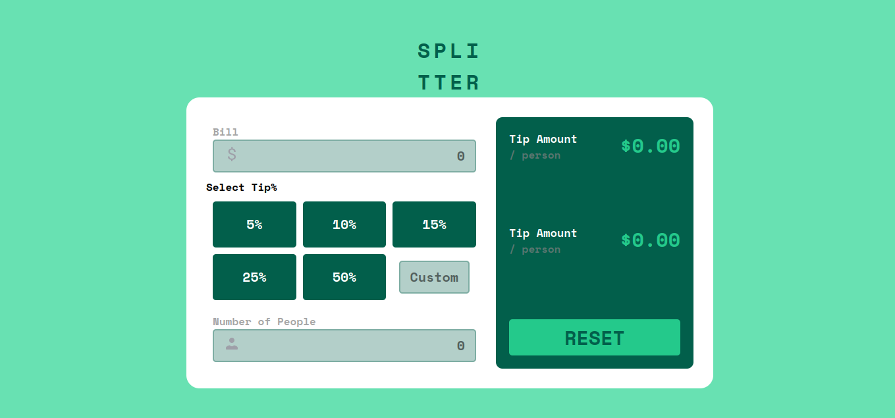
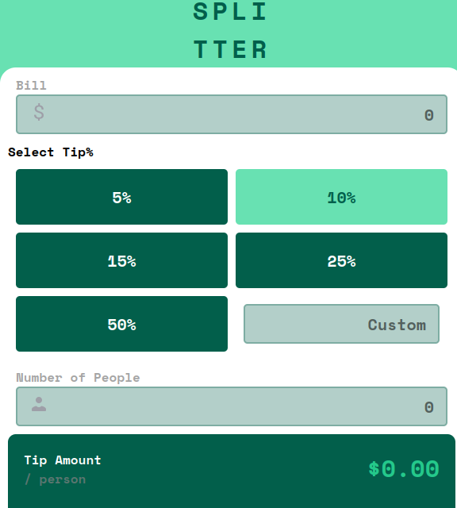

# Frontend Mentor - Tip calculator app solution

This is a solution to the [Tip calculator app challenge on Frontend Mentor](https://www.frontendmentor.io/challenges/tip-calculator-app-ugJNGbJUX). Frontend Mentor challenges help you improve your coding skills by building realistic projects.

## Table of contents

- [Overview](#overview)
  - [The challenge](#the-challenge)
  - [Screenshot](#screenshot)
  - [Links](#links)
- [My process](#my-process)
  - [Built with](#built-with)
  - [What I learned](#what-i-learned)
  - [Continued development](#continued-development)
  - [Useful resources](#useful-resources)
- [Author](#author)
- [Acknowledgments](#acknowledgments)


## Overview

### The challenge

Users should be able to:

- View the optimal layout for the app depending on their device's screen size
- See hover states for all interactive elements on the page
- Calculate the correct tip and total cost of the bill per person

### Screenshot


-------------------------



### Links

- Live Site URL: [Add live site URL here](https://tip-app-seven.vercel.app/)

## My process

### Built with

- Semantic HTML5 markup
- CSS custom properties
- Flexbox
- CSS Grid
- Mobile-first workflow
- [React](https://reactjs.org/) - JS library
- [CSS modules]() - For styles


### What I learned


```js
I learned How to use Cypress library to testing
```

If you want more help with writing markdown, we'd recommend checking out [The Markdown Guide](https://www.markdownguide.org/) to learn more.


### Continued development

- I will improve the custom tip functionality more
- I will add tests using Jest and testing Library


### Useful resources

- [React docs](https://react.dev/) - This helped me for understanding the core of the React.js library.


## Author

- Website - [Abdessittir harkati](https://abdessittirharkati.vercel.app/)
- Frontend Mentor - [@Abdessittir](https://www.frontendmentor.io/profile/Abdessittir)
- Twitter - [@AbdessittirHar1](https://www.twitter.com/AbdessittirHar1)


## Acknowledgments

- I would like to thank [datarockets](https://datarockets.com/) for giving me this opportunity to showcase my skills, and hopefully, I will be a part of this amazing team
- Also I would like to thank [frontendmentor](https://www.frontendmentor.io/home) for providing this great challenge
